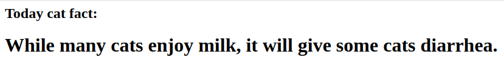

# sbt-isdw
## Задание 1
**Запуск:**
1. Запустить ```./run.sh```
2. Открыть новый терминал и запустить```./get-url.sh``` для получения адреса
3. Открыть страницу по адресу

**Удаление:**
1. Запустить ```./delete.sh```

## Фото страницы(рандомный факт о кошках):



